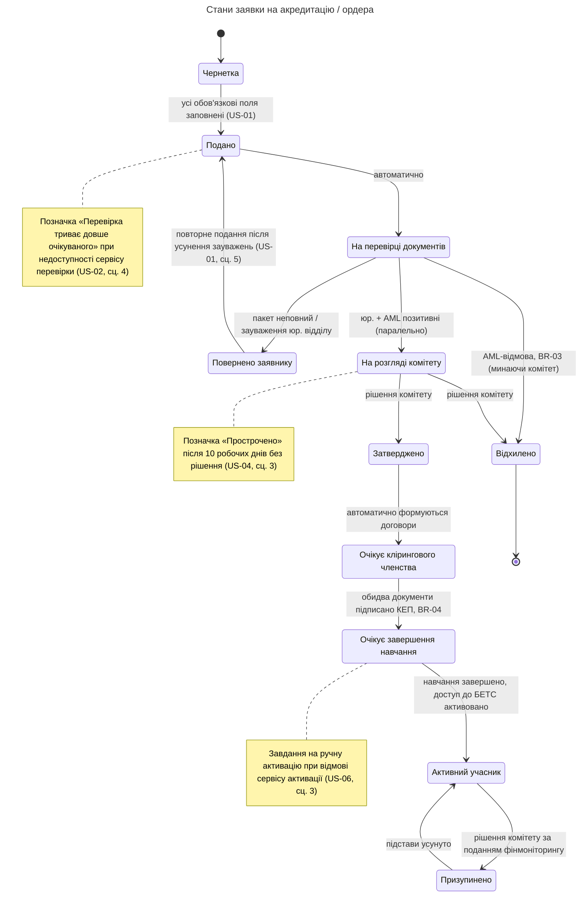
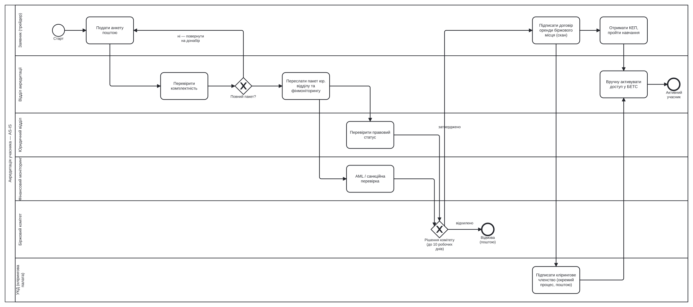
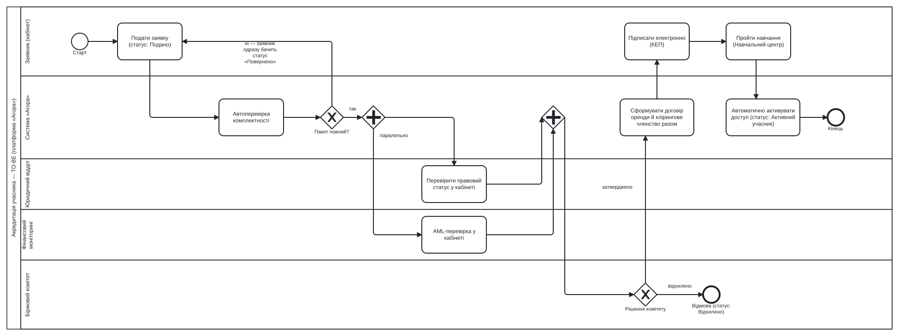

# Агора — BA-артефакти: акредитація учасників

Комплект аналітичних артефактів для процесу акредитації учасників торгової платформи «Агора»: ролі, права доступу, статуси заявки та переходи між ними.

Пов'язаний інтерактивний прототип: [відкрити «Агору»](https://alexeyglenbrook.github.io/agora-energy-exchange/agora_energy_exchange_prototype.html).

*Прототип клікабельно демонструє головне правило видимості (BR-02, розділ 2) та фінальний крок персоналу (акредитувати / призупинити / відновити). Повний багатоетапний пайплайн — Чернетка → Подано → перевірка юридичним відділом і фінмоніторингом → розгляд Біржового комітету → підписання КЕП → навчання — це цільова специфікація, описана в розділах 2, 4, 6 і 8, а не клікабельний функціонал прототипу.*

## Зміст

- [1. Ролі процесу](#1-ролі-процесу)
- [2. Бізнес-правила](#2-бізнес-правила)
- [3. Матриця доступів](#3-матриця-доступів)
- [4. Статуси заявки та переходи](#4-статуси-заявки-та-переходи)
- [5. Діаграма станів заявки (UML State Diagram)](#5-діаграма-станів-заявки-uml-state-diagram)
- [6. Процес акредитації AS-IS та TO-BE](#6-процес-акредитації-as-is-та-to-be)
- [7. Декомпозиція: Epic → Features → User Stories](#7-декомпозиція-epic--features--user-stories)
- [8. User stories та acceptance criteria](#8-user-stories-та-acceptance-criteria)
- [9. UAT-чекліст](#9-uat-чекліст)
- [10. REST API: ендпоінти та обробка помилок](#10-rest-api-ендпоінти-та-обробка-помилок)

## 1. Ролі процесу

| Роль | Тип | Опис |
|---|---|---|
| Заявник / Трейдер | Зовнішня | Компанія — учасник ринку. До акредитації подає заявку; після — торгує в межах власного ліміту. |
| Співробітник відділу акредитації | Внутрішня | Первинна перевірка пакету документів, супровід заявки процесом. |
| Юридичний відділ | Внутрішня | Перевірка правового статусу та повноважень заявника. |
| Фінансовий моніторинг | Внутрішня | AML/KYC-перевірка, санкційні списки; ініціює призупинення при порушеннях. |
| Біржовий комітет | Внутрішня, колегіальна | Ухвалює фінальне рішення про акредитацію, відхилення, призупинення чи відновлення. |
| Адміністратор системи | Внутрішня, технічна | Керує обліковими записами та правами доступу. Не бере участі у бізнес-рішеннях. |

## 2. Бізнес-правила

Наскрізні бізнес-правила процесу акредитації, зведені окремо від user stories, щоб їх можна було перевіряти і трасувати незалежно від конкретного сценарію. ID використовуються для трасування з матрицею доступів (розділ 3), UAT-чеклістом (розділ 9) та прототипом.

| ID | Опис | Де застосовується | Що валідує |
|---|---|---|---|
| BR-01 | Компанія не може мати більше однієї заявки на акредитацію в активному розгляді одночасно (унікальність за ЄДРПОУ) | Подання заявки (US-01, сценарій 3) | Блокує подання другої заявки, поки перша не отримала фінальний статус |
| **BR-02** | **Приватні дані учасника (контакти, ліміти, заявки на акредитацію) видимі лише персоналу біржі та самому учаснику щодо власних даних; дії «Акредитувати» / «Призупинити» / «Відновити» доступні лише персоналу** | Кабінет учасника, картка учасника, реєстр (розділ 3, US-08 сценарій 2) | Роль «Трейдер» не бачить приватних даних інших учасників і не може викликати керуючі дії над чужою акредитацією — головне правило видимості, яке демонструє цей прототип |
| BR-03 | Заявка з підтвердженою наявністю заявника в санкційному списку відхиляється за рішенням Фінансового моніторингу, без направлення на розгляд Біржового комітету | AML-перевірка (US-03, сценарій 2; розділ 4) | Не допускає колегіального розгляду заявки з підтвердженою AML-підставою для відмови |
| BR-04 | Кваліфікований електронний підпис (КЕП), яким підписуються договір оренди та договір клірингового членства, має бути дійсним на момент підписання | Підписання договорів (US-05, сценарій 2) | Прострочений або відкликаний сертифікат — підпис відхиляється, документи залишаються непідписаними |
| BR-05 | Обсяг заявки на купівлю/продаж не може перевищувати вільний ліміт, виданий учаснику за результатами акредитації (загальний ліміт мінус використаний) | Виставлення заявки в «Торги» (US-07, сценарій 2) | Блокує подання заявки з перевищенням вільного ліміту |

**BR-02** навмисно виділено — це те саме єдине жорстке бізнес-правило, навколо якого спроєктований прототип (розділ 3, матриця доступів): видимість чужих приватних даних і керуючі дії над акредитацією обмежені виключно роллю персоналу.

Одночасне формування й підписання договору оренди та договору клірингового членства (BR-04) передбачає інтеграцію платформи «Агора» з системою Української клірингової палати (УКД) — юридично окремої установи, а не підрозділу біржі. Без такої інтеграції «Агора» не мала б підстав формувати документ за УКД.

## 3. Матриця доступів

Функціональна область × роль.

| Функціональна область | Заявник / Трейдер | Співроб. акредитації | Юридичний відділ | Фінмоніторинг | Біржовий комітет | Адмін. системи |
|---|---|---|---|---|---|---|
| Власна заявка на акредитацію | W | R | R | R | R | — |
| Заявки інших учасників | — | R | R | R | R | — |
| Приватні дані учасника (контакти, ліміти) | R-own | R | R | R | R | — |
| Публічний реєстр акредитованих | R | R | — | — | — | — |
| Перевірка пакету документів | — | W | R | — | — | — |
| AML / санкційна перевірка | — | — | — | W | — | — |
| Рішення: акредитувати / відхилити | — | — | — | — | A | — |
| Відхилення за AML (санкційні списки) | — | — | — | A† | — | — |
| Рішення: призупинити / відновити | — | — | — | W* | A | — |
| Торгівля на біржі | W (own) | — | — | — | — | — |
| Керування обліковими записами | — | — | — | — | — | A |

**Легенда:** — немає доступу · `R` перегляд · `R-own` перегляд лише власних даних · `W` створення/редагування · `A` ухвалення рішення.

\* `W` тут означає ініціювання (подання) призупинення за підозрою, а не ухвалення рішення — фінмоніторинг формує подання, але остаточне рішення («A») ухвалює виключно Біржовий комітет.

† AML-відхилення — окреме, самостійне рішення фінмоніторингу на етапі перевірки документів (санкційні списки тощо), відмінне від рішення «акредитувати / відхилити»: розгляд комітету в цьому випадку минається (розділ 4). На відміну від «*», тут фінмоніторинг ухвалює рішення самостійно, тому позначка — «A».

Юридичний відділ, фінмоніторинг і Біржовий комітет окремого доступу до «Публічного реєстру акредитованих» не потребують — їхній `R` на «Заявки інших учасників» і «Приватні дані учасника» вище вже покриває (і перевищує) ці дані. Адміністратор системи не має доступу на читання бізнес-даних узагалі — за визначенням ролі (розділ 1) він керує лише обліковими записами й не бере участі в бізнес-рішеннях.

## 4. Статуси заявки та переходи

| Перехід | Роль(і), що ініціюють | Умова / примітка |
|---|---|---|
| Чернетка → Подано | Заявник | Заповнено всі обов'язкові поля анкети, немає активної заявки з тим самим ЄДРПОУ |
| Подано → На перевірці документів | Система (автоматично) | Одразу після реєстрації заявки |
| На перевірці документів → Повернено заявнику | Система (автоматично) | Автоперевірка виявила відсутній або невалідний документ |
| На перевірці документів → Повернено заявнику | Співроб. акредитації | За зауваженням юридичного відділу до статутних документів |
| Повернено заявнику → Подано | Заявник | Довантажено відсутні документи або усунуто зауваження, заявник подає заявку повторно (US-01, сценарій 5) |
| На перевірці документів → На розгляді комітету | Система (автоматично) | Пакет повний; юридична та AML-перевірка завершені паралельно, обидва висновки позитивні |
| На перевірці документів → Відхилено | Фінмоніторинг | AML-перевірка виявила підстави для відмови (санкційні списки тощо) — розгляд комітету минається |
| На розгляді комітету → Затверджено | Біржовий комітет | Колегіальне рішення, протягом 10 робочих днів |
| На розгляді комітету → Відхилено | Біржовий комітет | Колегіальне рішення не на користь заявника |
| Затверджено → Очікує клірингового членства | Система (автоматично) | Формуються договір оренди та договір клірингового членства одночасно |
| Очікує клірингового членства → Очікує завершення навчання | Заявник | Обидва документи підписано кваліфікованим електронним підписом (КЕП) |
| Очікує завершення навчання → Активний учасник | Система (автоматично) | Курс у Навчальному центрі завершено; доступ до БЕТС активується автоматично |
| Активний учасник → Призупинено | Біржовий комітет | За поданням фінмоніторингу; порушення правил торгів або виявлені підстави |
| Призупинено → Активний учасник | Біржовий комітет | Підстави для призупинення усунуто |

«Відхилено» і «Призупинено» навмисно розведені як окремі стани: відмова новій заявці й призупинення вже діючого учасника — різні бізнес-події з різною відповідальністю.

Три службові позначки не є окремими статусами — заявка залишається в поточному статусі, позначка лише сигналізує про відхилення від нормального перебігу: «Перевірка триває довше очікуваного» на статусі «Подано» (US-02, сценарій 4), «Прострочено» на статусі «На розгляді комітету» (US-04, сценарій 3) та завдання на ручну активацію при статусі «Очікує завершення навчання» (US-06, сценарій 3).

## 5. Діаграма станів заявки (UML State Diagram)

Діаграма станів для заявки на акредитацію / ордера — той самий перелік станів і переходів, що й у таблиці розділу 4, у вигляді UML state diagram.



Поза межами цієї специфікації: термінація акредитації (добровільний вихід учасника, розірвання договору оренди чи клірингового членства). У поточній моделі «Активний учасник» і «Призупинено» — єдині стани після затвердження, тобто акредитація не має визначеного фінального виходу за межі цих двох станів. За потреби розширення: окремий статус (наприклад, «Розірвано») з переходами з «Активний учасник» і «Призупинено», власним ініціатором (заявник — за власним рішенням; Біржовий комітет — за грубим порушенням) та окремою user story. Свідомо винесено за межі цього артефакту, щоб не розмивати фокус на процесі акредитації.

З тієї ж причини поза межами специфікації залишається і зворотний випадок: заявник, що застряг на «Очікує клірингового членства» або «Очікує завершення навчання» без дій (не підписує КЕП, не проходить навчання) понад розумний термін. Модель не визначає таймаут чи автоматичне анулювання для цих двох станів — заявка залишається там необмежено довго. За потреби: таймаут (наприклад, 60 днів) з переходом у той самий гіпотетичний статус «Розірвано» вище.

## 6. Процес акредитації AS-IS та TO-BE

### 6.1 AS-IS

Поточний процес: паперовий/поштовий обмін між відділами, заявник не бачить статус до фінального листа.



[🔍 Відкрити AS-IS у повному розмірі (raw SVG)](https://raw.githubusercontent.com/Alexeyglenbrook/agora-energy-exchange/master/agora_bpmn_as_is.svg) — і вбудоване зображення, і сторінка попереднього перегляду GitHub стискають діаграму під невелику рамку; посилання на raw-файл відкриває векторний SVG як окремий документ у натуральному розмірі, де працює звичайний зум браузера.

Больові точки: ручна пересилка поштою між чотирма відділами, заявник не має видимості статусу під час розгляду, договір оренди й клірингове членство — два непов'язані процеси, фінальна активація доступу — ручна дія.

### 6.2 TO-BE

Цільовий процес: усі учасники працюють в одній системі, кожен крок відповідає статусу заявки (розділ 4), заявник бачить прогрес у кабінеті.



[🔍 Відкрити TO-BE у повному розмірі (raw SVG)](https://raw.githubusercontent.com/Alexeyglenbrook/agora-energy-exchange/master/agora_bpmn_to_be.svg)

### 6.3 Ключові відмінності

| Що змінюється | AS-IS | TO-BE |
|---|---|---|
| Перевірка комплектності документів | Вручну співробітником акредитації | Автоматично при поданні, за чек-листом |
| Маршрутизація до юр. відділу та фінмоніторингу | Ручне пересилання поштою | Паралельна автоматична маршрутизація |
| Видимість статусу для заявника | Лише фінальний лист | Статус в кабінеті на кожному кроці |
| Договір оренди та клірингове членство | Два незалежні процеси (біржа окремо, УКД окремо) | Формуються й підписуються одночасно |
| Активація доступу до БЕТС | Ручна дія співробітника акредитації | Автоматична після виконання умов |

## 7. Декомпозиція: Epic → Features → User Stories

**Epic.** Акредитація учасника платформи «Агора» — від подання заявки до першої угоди в межах виданого ліміту.

Epic розкладений на функціональні блоки (features), кожен з яких закритий однією або кількома user stories з розділу 8. Декомпозиція дозволяє оцінювати й планувати роботу по блоках, не тримаючи в голові одразу весь процес.

| Feature | Назва | Навіщо (мета блоку) | User stories | Пов'язані BR |
|---|---|---|---|---|
| F-01 | Подання та первинна перевірка заявки | Прийняти заявку від заявника і відсіяти завідомо неповні пакети до участі людей | US-01, US-02 | BR-01 |
| F-02 | Юридична та AML-перевірка | Паралельно перевірити правовий статус і санкційні ризики заявника | US-03 | BR-03 |
| F-03 | Рішення Біржового комітету | Ухвалити колегіальне рішення про допуск заявника на біржу | US-04 | — |
| F-04 | Оформлення договорів та підписання КЕП | Юридично оформити відносини з учасником одним підписанням замість двох паперових процесів | US-05 | BR-04 |
| F-05 | Активація доступу після навчання | Відкрити доступ до торгової системи автоматично, без ручних затримок | US-06 | — |
| F-06 | Управління статусом учасника | Дати комітету інструмент оперативно обмежити або відновити доступ уже акредитованого учасника | US-08 | BR-02 |
| F-07 | Торгівля в межах виданого ліміту | Дозволити акредитованому трейдеру торгувати, не перевищуючи ліміт, виданий за результатами акредитації | US-07 | BR-05 |

F-01–F-05 покривають життєвий цикл однієї заявки (розділ 4, статуси Чернетка → Активний учасник); F-06 і F-07 — те, що відбувається з учасником і його лімітом уже після успішної акредитації.

## 8. User stories та acceptance criteria

Стори реалізують features з розділу 7 і описують цільовий (TO-BE) процес із розділу 6 та ролі з розділу 1. Кожна стори мала, незалежна від інших і перевіряється через acceptance criteria нижче (INVEST). Формат критеріїв — Given/When/Then; для кожної стори наведено як мінімум один негативний сценарій, а де це має сенс — і сценарій відмови сервісу.

### US-01. Подання заявки на акредитацію

**Як** заявник, **я хочу** подати заявку на акредитацію через кабінет, **щоб** розпочати процес входу на біржу без паперового листування.

Сценарій 1 — успішне подання
```
Given заявник заповнив усі обов'язкові поля анкети та завантажив повний пакет документів
When він натискає «Подати заявку»
Then заявка отримує статус «Подано», а заявник бачить цей статус у своєму кабінеті
```

Сценарій 2 — не заповнені обов'язкові поля
```
Given заявник залишив порожнім обов'язкове поле (наприклад, ЄДРПОУ)
When він намагається подати заявку
Then API повертає 400 Bad Request (MISSING_FIELD), система блокує подання, підсвічує відсутнє поле і залишає заявку в статусі «Чернетка»
```

Сценарій 3 — дублювання заявки
```
Given компанія з таким ЄДРПОУ вже має заявку в активному розгляді
When подається друга заявка з тим самим ЄДРПОУ
Then API повертає 409 Conflict (DUPLICATE_APPLICATION), система відхиляє подання з повідомленням «Заявка з таким ЄДРПОУ вже перебуває на розгляді»
```

Сценарій 4 — недоступний сервіс збереження
```
Given усі поля заповнені коректно
When заявник натискає «Подати заявку», а сервіс збереження не відповідає (timeout або 5xx)
Then API повертає 503 Service Unavailable (EXTERNAL_SERVICE_DOWN), система показує повідомлення «Не вдалося подати заявку, спробуйте ще раз» і зберігає введені дані як чернетку, щоб заявник нічого не втратив
```

Сценарій 5 — повторне подання після повернення
```
Given заявка має статус «Повернено заявнику», і заявник довантажив відсутні документи або усунув зауваження
When він повторно натискає «Подати заявку»
Then заявка знову отримує статус «Подано» і проходить автоперевірку та маршрутизацію заново
```

### US-02. Автоматична перевірка комплектності пакета документів

**Як** система, **я маю** автоматично перевіряти комплектність пакета документів одразу після подання, **щоб** відділ акредитації не витрачав час на завідомо неповні заявки.

Сценарій 1 — пакет повний
```
Given заявка подана і містить усі обов'язкові документи
When система виконує автоперевірку
Then заявка переходить у статус «На перевірці документів» і паралельно маршрутизується до юридичного відділу та фінмоніторингу
```

Сценарій 2 — відсутній обов'язковий документ
```
Given у пакеті відсутній обов'язковий документ (наприклад, виписка з ЄДР)
When система виконує автоперевірку
Then заявка отримує статус «Повернено» з переліком відсутніх документів, заявнику надсилається сповіщення
```

Сценарій 3 — недопустимий формат файлу
```
Given заявник завантажує файл у форматі, який не підтримується (наприклад, .exe)
When система обробляє завантаження
Then API повертає 400 Bad Request (INVALID_FILE_FORMAT), файл відхиляється одразу, з поясненням дозволених форматів (PDF, JPG)
```

Сценарій 4 — сервіс перевірки недоступний
```
Given заявка подана і готова до автоперевірки
When сервіс перевірки комплектності не відповідає
Then API повертає 503 Service Unavailable (EXTERNAL_SERVICE_DOWN), заявка залишається в статусі «Подано» з позначкою «Перевірка триває довше очікуваного», а відділу акредитації створюється завдання на ручну перевірку
```

### US-03. Юридична та AML-перевірка заявника

**Як** співробітник юридичного відділу або фінмоніторингу, **я хочу** бачити заявку з документами у своєму кабінеті одразу після автоперевірки, **щоб** паралельно провести перевірку правового статусу та AML без очікування на іншу службу.

Сценарій 1 — обидві перевірки пройдено
```
Given заявка в статусі «На перевірці документів»
When і юридичний відділ, і фінмоніторинг завершують перевірку без зауважень
Then заявка автоматично переходить у статус «На розгляді комітету»
```

Сценарій 2 — AML-відмова
```
Given фінмоніторинг виявляє компанію в санкційному списку
When співробітник фінмоніторингу фіксує негативний висновок
Then заявка одразу переходить у статус «Відхилено», минаючи розгляд комітету, із зазначеною причиною відмови
```

Сценарій 3 — юридичні зауваження
```
Given юридичний відділ виявляє розбіжність у статутних документах заявника
When юридичний відділ фіксує зауваження, і відділ акредитації оформлює повернення заявки
Then заявка переходить у статус «Повернено» з коментарем від юридичного відділу
```

Сценарій 4 — сервіс перевірки (реєстри, санкційні списки) недоступний
```
Given заявка в статусі «На перевірці документів»
When зовнішній сервіс перевірки (реєстр ЄДР або санкційні списки) не відповідає
Then API повертає 503 Service Unavailable (EXTERNAL_SERVICE_DOWN), перевірка позначається як незавершена, заявка залишається в поточному статусі, відповідальному співробітнику створюється завдання повторити перевірку пізніше
```

Юридичний відділ має лише перегляд (`R`) пакета документів (розділ 3) і не змінює статус заявки самостійно — зауваження виконує відділ акредитації (`W`), щоб не розмивати межі ролей із розділу 3.

### US-04. Ухвалення рішення Біржовим комітетом

**Як** член Біржового комітету, **я хочу** бачити всі висновки (юридичний, AML) в одній картці заявки, **щоб** ухвалити обґрунтоване рішення протягом встановленого терміну.

Сценарій 1 — заявку затверджено
```
Given заявка в статусі «На розгляді комітету» з позитивними висновками обох служб
When комітет голосує «Затвердити»
Then заявка переходить у статус «Затверджено», і система автоматично формує договір оренди та договір клірингового членства
```

Сценарій 2 — заявку відхилено
```
Given заявка перебуває на розгляді комітету
When комітет голосує «Відхилити»
Then заявка переходить у статус «Відхилено», заявник отримує сповіщення з причиною відмови
```

Сценарій 3 — прострочення терміну розгляду
```
Given заявка перебуває на розгляді комітету понад 10 робочих днів без рішення
When настає 11-й робочий день
Then система позначає заявку міткою «Прострочено» і надсилає нагадування голові комітету
```

Сценарій 4 — сервіс формування договорів недоступний
```
Given комітет затвердив заявку
When сервіс формування договору оренди та договору клірингового членства не відповідає
Then API повертає 504 Gateway Timeout (OPERATION_TIMEOUT), заявка залишається в статусі «Затверджено», система повторює спробу автоматично, а відділу акредитації створюється завдання на ручне формування документів
```

### US-05. Електронне підписання договору оренди та клірингового членства

**Як** заявник, **я хочу** підписати договір оренди біржового місця та договір клірингового членства одним КЕП, **щоб** не проходити два окремі паперові процеси.

Сценарій 1 — успішне підписання
```
Given заявка в статусі «Очікує клірингового членства» (система вже автоматично сформувала обидва документи)
When заявник підписує обидва документи кваліфікованим електронним підписом
Then заявка переходить у статус «Очікує завершення навчання», і заявнику відкривається доступ до навчального центру
```

Сценарій 2 — недійсний КЕП
```
Given заявник намагається підписати документи
When термін дії його КЕП закінчився
Then API повертає 400 Bad Request (INVALID_SIGNATURE), система відхиляє підпис з повідомленням «Ваш КЕП недійсний, оновіть сертифікат», документи залишаються непідписаними
```

Сценарій 3 — сервіс перевірки підпису недоступний
```
Given заявник підписує документи
When зовнішній сервіс перевірки КЕП (ЦСК) недоступний
Then API повертає 503 Service Unavailable (EXTERNAL_SERVICE_DOWN), система показує повідомлення «Сервіс підпису тимчасово недоступний, спробуйте пізніше» і не втрачає вже заповнені дані заявки
```

### US-06. Автоматична активація доступу після навчання

**Як** система, **я маю** автоматично активувати доступ учасника до БЕТС одразу після виконання всіх умов (підписані договори й пройдене навчання), **щоб** виключити ручні затримки з боку відділу акредитації.

Сценарій 1 — обидві умови виконано
```
Given заявник підписав договори і завершив курс у навчальному центрі
When система перевіряє виконання обох умов
Then заявка переходить у статус «Активний учасник», і заявнику надається доступ до торгової системи
```

Сценарій 2 — навчання не завершено
```
Given заявник підписав договори, але не завершив навчальний курс
When минає 30 днів з моменту підписання
Then система надсилає нагадування, залишає заявку в статусі «Очікує завершення навчання», доступ не активується
```

Сценарій 3 — помилка сервісу активації
```
Given обидві умови виконано
When сервіс активації доступу в БЕТС повертає помилку
Then API повертає 504 Gateway Timeout (ACTIVATION_TIMEOUT), система повторює спробу автоматично; якщо після трьох спроб активація не вдалась, створюється завдання для співробітника акредитації на ручне втручання
```

### US-07. Виставлення заявки на купівлю/продаж у межах ліміту

**Як** трейдер, **я хочу** виставити заявку на купівлю або продаж електроенергії, **щоб** взяти участь у торгах на добу наперед.

Сценарій 1 — успішне виставлення
```
Given у трейдера достатньо вільного ліміту для заявленого обсягу
When він вказує ціну та обсяг і натискає «Виставити заявку»
Then заявка потрапляє в стакан або виконується одразу, якщо перетинає найкращу зустрічну ціну
```

Сценарій 2 — перевищення вільного ліміту
```
Given обсяг заявки перевищує вільний ліміт трейдера
When він намагається виставити заявку
Then API повертає 409 Conflict (LIMIT_EXCEEDED), система блокує подання і показує повідомлення з доступним залишком ліміту
```

Сценарій 3 — невалідна ціна
```
Given трейдер не вказав ціну або вказав від'ємне значення
When він натискає «Виставити заявку»
Then API повертає 400 Bad Request (INVALID_PRICE), система показує помилку валідації поля, заявка не подається
```

Сценарій 4 — сервіс стакану заявок недоступний
```
Given усі поля заповнені коректно
When сервіс стакану заявок не відповідає в момент подання
Then API повертає 503 Service Unavailable (EXTERNAL_SERVICE_DOWN), система показує повідомлення «Не вдалося виставити заявку, спробуйте ще раз» і не змінює використаний ліміт трейдера
```

### US-08. Призупинення акредитації учасника

**Як** Біржовий комітет (за поданням фінмоніторингу), **я хочу** мати можливість призупинити акредитацію учасника, **щоб** оперативно обмежити доступ у разі порушення правил торгів або виявлення підстав для занепокоєння.

Сценарій 1 — призупинення
```
Given учасник має статус «Активний учасник», і виявлено підставу для призупинення
When комітет ухвалює рішення «Призупинити»
Then статус учасника змінюється на «Призупинено», доступ до торгів блокується негайно, активні заявки учасника скасовуються
```

Сценарій 2 — спроба дії без прав
```
Given користувач з роллю «Трейдер» намагається змінити статус іншого учасника
When він звертається до відповідної дії напряму, минаючи інтерфейс
Then API повертає 403 Forbidden (ACCESS_DENIED), система відхиляє дію з помилкою доступу, оскільки право на цю дію має лише роль «Біржовий комітет»
```

Сценарій 3 — відновлення після усунення підстав
```
Given учасник має статус «Призупинено», і підстави для призупинення усунуто
When комітет ухвалює рішення «Відновити»
Then статус учасника повертається на «Активний учасник», доступ відновлюється
```

## 9. UAT-чекліст

Сценарії для приймального тестування бізнес-користувачем перед виходом у продакшн. Кожен пункт перевіряє конкретний результат, а не технічну реалізацію, і посилається на відповідну user story або розділ матриці доступів.

| № | Сценарій | Передумови | Кроки | Очікуваний результат | Пов'язано з | Статус |
|---|---|---|---|---|---|---|
| 1 | Повний щасливий шлях акредитації | Заявник не акредитований, пакет документів повний | Подати заявку → пройти автоперевірку → юридичну та AML-перевірку → комітет затверджує → підписати КЕП → пройти навчання | Статус послідовно проходить Подано → На перевірці документів → На розгляді комітету → Затверджено → Очікує клірингового членства → Очікує завершення навчання → Активний учасник; доступ до БЕТС відкрито | US-01–US-06 | ☐ |
| 2 | Повернення заявки при неповному пакеті | Заявка подається без одного обов'язкового документа | Подати заявку | Статус «Повернено», заявник бачить перелік відсутніх документів у кабінеті | US-02 | ☐ |
| 3 | AML-відмова минає розгляд комітету | Заявник у санкційному списку | Фінмоніторинг фіксує негативний висновок | Заявка одразу переходить у «Відхилено», комітет не залучається | US-03 | ☐ |
| 4 | Комітет відхиляє заявку | Заявка на розгляді комітету, висновки позитивні | Комітет голосує «Відхилити» | Статус «Відхилено», заявник отримує причину відмови | US-04 | ☐ |
| 5 | Прострочення розгляду комітетом | Заявка на розгляді комітету понад 10 робочих днів | Настає 11-й робочий день без рішення | Заявка позначена міткою «Прострочено», голові комітету надіслано нагадування | US-04 | ☐ |
| 6 | Паралельність юридичної та AML-перевірки | Заявка щойно пройшла автоперевірку комплектності | Юридичний відділ і фінмоніторинг завершують перевірку в різному порядку | Перехід на розгляд комітету відбувається лише після завершення ОБОХ перевірок, порядок завершення не впливає на результат | TO-BE BPMN, US-03 | ☐ |
| 7 | Автоматична активація доступу | Заявник підписав договори й завершив навчання (у будь-якому порядку) | Дочекатися перевірки умов системою | Статус «Активний учасник», доступ до БЕТС відкрито автоматично, без дії співробітника | US-06 | ☐ |
| 8 | Ліміт трейдера при виставленні заявки | Активний трейдер, ліміт частково використаний | Спробувати виставити заявку з обсягом, що перевищує вільний залишок | Система блокує подання, показує доступний залишок ліміту | US-07 | ☐ |
| 9 | Призупинення та відновлення акредитації | Учасник має статус «Активний учасник» | Комітет призупиняє → пізніше відновлює | Доступ блокується негайно при призупиненні й повертається при відновленні; активні заявки скасовуються при призупиненні | US-08 | ☐ |
| 10 | Розмежування ролей: трейдер без прав на чужу акредитацію | Користувач залогінений з роллю «Трейдер» | Відкрити картку іншого учасника, спробувати викликати дію «Акредитувати» / «Призупинити» | Дій немає в інтерфейсі; приватні дані (контакти, ліміт) іншого учасника приховані; пряме звернення повертає помилку доступу | US-08 (сценарій 2), розділ 3 | ☐ |
| 11 | Робоче місце співробітника акредитації | Користувач залогінений з роллю «Акредитація» | Відкрити «Огляд» | Видно чергу заявок на розгляді та статистику реєстру; розділи «Торги» й «Котирування» недоступні | Розділ 1, 3 | ☐ |
| 12 | Видимість статусу для заявника | Заявка подана й проходить обробку | Заявник перевіряє статус у кабінеті на кожному етапі | Статус завжди актуальний і видимий, без очікування листа поштою (на відміну від AS-IS) | Розділ 6.3 | ☐ |
| 13 | Відмова сервісу збереження заявки | Усі поля анкети заповнені коректно | Подати заявку в момент, коли сервіс збереження недоступний | Показано повідомлення про повторну спробу, введені дані збережено як чернетку, дані не втрачено | US-01 (сценарій 4) | ☐ |
| 14 | Недоступний сервіс перевірки КЕП | Заявка у статусі «Затверджено», документи готові до підпису | Підписати документи в момент недоступності зовнішнього сервісу перевірки підпису (ЦСК) | Показано повідомлення про тимчасову недоступність сервісу, заповнені дані заявки збережено | US-05 (сценарій 3) | ☐ |
| 15 | Відмова сервісу активації доступу | Обидві умови активації виконано (договори підписано, навчання завершено) | Сервіс активації доступу в БЕТС повертає помилку | Система автоматично повторює спробу; після трьох невдалих спроб створюється завдання співробітнику акредитації на ручну активацію | US-06 (сценарій 3) | ☐ |
| 16 | Недоступний сервіс перевірки (реєстри, санкційні списки) | Заявка у статусі «На перевірці документів» | Викликати перевірку в момент недоступності зовнішнього сервісу | Перевірка позначена незавершеною, заявка залишається в поточному статусі, створено завдання повторити перевірку | US-03 (сценарій 4) | ☐ |
| 17 | Відмова сервісу формування договорів | Комітет щойно затвердив заявку | Сервіс формування договору оренди та клірингового членства повертає помилку | Заявка залишається «Затверджено», система повторює спробу автоматично, створено завдання на ручне формування документів | US-04 (сценарій 4) | ☐ |
| 18 | Коди помилок API відповідають контракту | Будь-який негативний сценарій із розділів 8–9 | Спровокувати помилку (валідація, конфлікт, відмова доступу, недоступність сервісу) | HTTP-код і `code` у відповіді відповідають таблиці розділу 10 | Розділ 10 | ☐ |
| 19 | Повторне подання після повернення заявки | Заявка має статус «Повернено заявнику» | Довантажити відсутній документ / усунути зауваження, повторно подати заявку | Заявка знову отримує статус «Подано» і проходить автоперевірку заново; заявник не заповнює анкету з нуля | US-01 (сценарій 5), розділ 4 | ☐ |

## 10. REST API: ендпоінти та обробка помилок

Ендпоінти напряму відповідають діям із user stories (розділ 8) — кожен рядок нижче можна прочитати як «яким запитом реалізується цей крок сценарію». Автентифікація/авторизація за роллю відповідає матриці доступів (розділ 3); тут вказано лише роль, якій дозволено викликати ендпоінт.

| Метод і шлях | Опис | Роль | User story | Тіло запиту (ключові поля) | Успішна відповідь |
|---|---|---|---|---|---|
| `POST /applications` | Подати заявку на акредитацію | Заявник | US-01 | `{ edrpou, companyName, segment }` | `201 { id, status: "submitted" }` |
| `POST /applications/{id}/documents` | Завантажити / довантажити документ пакета | Заявник | US-01 (сц. 5), US-02 | multipart-файл | `200 { documentId, status }` |
| `POST /applications/{id}/resubmit` | Повторно подати заявку зі статусу «Повернено заявнику» | Заявник | US-01 (сц. 5) | — | `200 { id, status: "submitted" }` |
| `GET /applications/{id}` | Отримати поточний статус заявки та історію переходів | Заявник (own), персонал (R) | усі US-01…US-06 | — | `200 { id, status, history[] }` |
| `PATCH /applications/{id}/legal-review` | Внести висновок юридичного відділу (юрист має лише `R`, розділ 3; в системі це фіксує відділ акредитації) | Співроб. акредитації | US-03 (сц. 1, 3) | `{ verdict: "approved"\|"rejected", comment }` | `200 { status }` |
| `PATCH /applications/{id}/aml-review` | Зафіксувати AML-висновок | Фінмоніторинг | US-03 (сц. 1, 2) | `{ verdict: "approved"\|"rejected", reason }` | `200 { status }` |
| `PATCH /applications/{id}/committee-decision` | Ухвалити рішення комітету | Біржовий комітет | US-04 (сц. 1, 2) | `{ decision: "approve"\|"reject" }` | `200 { status }` |
| `POST /applications/{id}/sign` | Підписати договір оренди та клірингового членства КЕП | Заявник | US-05 | `{ signature }` | `200 { status }` |
| `POST /applications/{id}/activate` | Тригер активації доступу після виконання умов | Система | US-06 | — | `200 { status: "active" }` |
| `POST /orders` | Виставити заявку на купівлю/продаж | Трейдер | US-07 | `{ marketId, side, price, volume }` | `201 { orderId, status }` |
| `PATCH /participants/{id}/status` | Призупинити або відновити акредитацію учасника | Біржовий комітет | US-08 | `{ action: "suspend"\|"restore" }` | `200 { status }` |

API повертає стандартизовану відповідь із кодом HTTP та машинозчитуваним кодом помилки (`code`), що дозволяє реалізувати негативні сценарії та сценарії відмови сервісів із розділу 8 і UAT-чекліста розділу 9 однаково для всіх ендпоінтів вище.

Стандартна форма відповіді про помилку:

```json
{
  "code": "MACHINE_READABLE_CODE",
  "message": "Повідомлення людською мовою для інтерфейсу",
  "field": "необов'язково — назва поля, якщо помилка валідації"
}
```

| HTTP-код | Ситуація | Приклад тіла відповіді | Ендпоінт / User story |
|---|---|---|---|
| `400 Bad Request` | Не заповнено обов'язкове поле анкети | `{"code": "MISSING_FIELD", "field": "edrpou", "message": "ЄДРПОУ є обов'язковим"}` | `POST /applications` — US-01, сценарій 2 |
| `400 Bad Request` | Недопустимий формат файлу документа | `{"code": "INVALID_FILE_FORMAT", "field": "document", "message": "Дозволені формати: PDF, JPG"}` | `POST /applications/{id}/documents` — US-02, сценарій 3 |
| `400 Bad Request` | Недійсний або прострочений КЕП | `{"code": "INVALID_SIGNATURE", "message": "Ваш КЕП недійсний, оновіть сертифікат"}` | `POST /applications/{id}/sign` — US-05, сценарій 2 |
| `400 Bad Request` | Невалідна ціна заявки | `{"code": "INVALID_PRICE", "field": "price", "message": "Ціна має бути додатним числом"}` | `POST /orders` — US-07, сценарій 3 |
| `409 Conflict` | Дублювання заявки на акредитацію | `{"code": "DUPLICATE_APPLICATION", "message": "Заявка з таким ЄДРПОУ вже на розгляді"}` | `POST /applications` — US-01, сценарій 3 |
| `409 Conflict` | Перевищення вільного ліміту трейдера | `{"code": "LIMIT_EXCEEDED", "message": "Перевищено вільний ліміт трейдера"}` | `POST /orders` — US-07, сценарій 2 |
| `403 Forbidden` | Спроба дії без відповідних прав ролі | `{"code": "ACCESS_DENIED", "message": "Роль 'Trader' не має права на зміну статусу учасника"}` | `PATCH /participants/{id}/status` — US-08, сценарій 2 |
| `503 Service Unavailable` | Зовнішній або внутрішній сервіс тимчасово недоступний | `{"code": "EXTERNAL_SERVICE_DOWN", "message": "Сервіс тимчасово недоступний, спробуйте пізніше"}` | `POST /applications`, `POST /applications/{id}/documents`, `PATCH /applications/{id}/aml-review`, `POST /applications/{id}/sign`, `POST /orders` |
| `504 Gateway Timeout` | Формування договорів не завершилось вчасно, потрібне ручне втручання | `{"code": "OPERATION_TIMEOUT", "message": "Операція не завершилась вчасно, створено завдання для ручного втручання"}` | `PATCH /applications/{id}/committee-decision` — US-04, сценарій 4 |
| `504 Gateway Timeout` | Активація доступу до БЕТС не завершилась вчасно після трьох автоматичних спроб | `{"code": "ACTIVATION_TIMEOUT", "message": "Активація не вдалась після трьох спроб, створено завдання для ручного втручання"}` | `POST /applications/{id}/activate` — US-06, сценарій 3 |

Принципи, спільні для всіх сценаріїв відмови сервісу:

- Введені користувачем дані ніколи не втрачаються при `503`/`504` — заявка чи форма зберігається як чернетка або залишається в поточному статусі.
- `503`/`504` не змінюють бізнес-стан (ліміт трейдера, статус заявки) — стан змінюється лише після підтвердженого успіху операції.
- Після вичерпання автоматичних повторних спроб (де вони передбачені — US-04, US-06) система створює завдання для ручного втручання відповідальному співробітнику, а не залишає заявку без власника.
